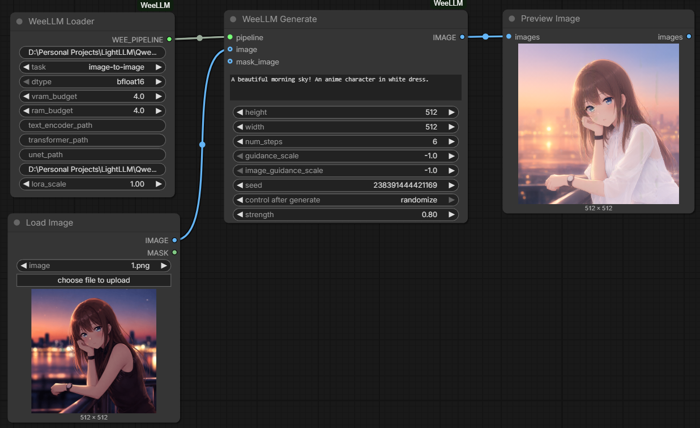
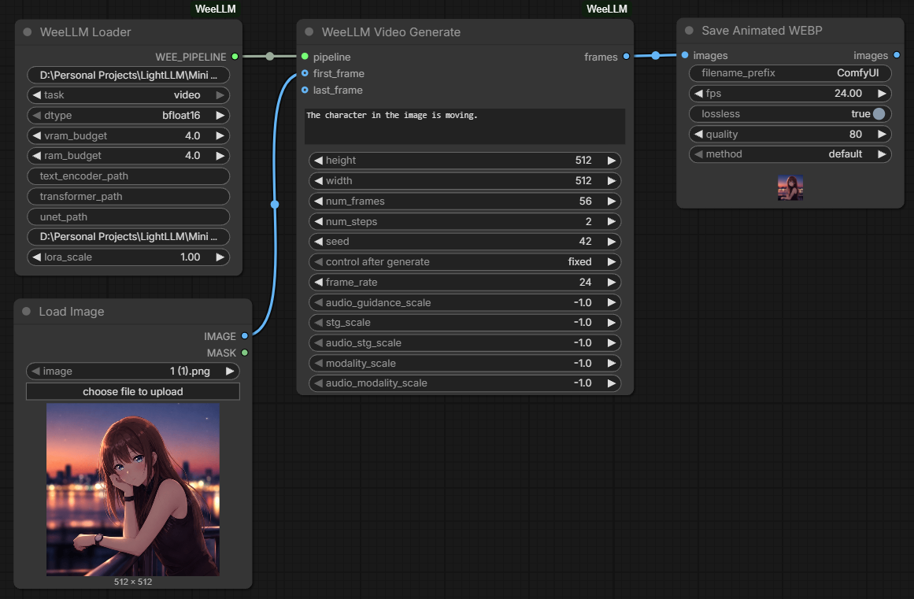

<div align="center">
	
	<br />
	<a href="https://camo.githubusercontent.com/5e3ae50ed74ba1fea6f7b2002fe729b6dac58900dde6ba310eaa26b56dd071dd/68747470733a2f2f696d672e736869656c64732e696f2f62616467652f5374617475732d4163746976652d737563636573732e737667"></a>
	<a href="https://camo.githubusercontent.com/7013272bd27ece47364536a221edb554cd69683b68a46fc0ee96881174c4214c/68747470733a2f2f696d672e736869656c64732e696f2f62616467652f6c6963656e73652d4d49542d626c75652e737667"></a>
	<a href="https://camo.githubusercontent.com/dd0b24c1e6776719edb2c273548a510d6490d8d25269a043dfabbd38419905da/68747470733a2f2f696d672e736869656c64732e696f2f62616467652f5052732d77656c636f6d652d627269676874677265656e2e737667"></a>
</div>

A native ComfyUI custom node wrapper for [WeeLLM](https://github.com/Jit-Roy/weellm) — bringing ultra-low VRAM layer-streaming inference directly into your Comfy workflows.

With ComfyUI-WeeLLM, you can run massive diffusion models (like FLUX, Stable Diffusion, Stable Diffusion XL, Z image, Krea2, Qwen Image, Ltx2.5 and MiniMax-H3) on GPUs with **less than 4GB of VRAM**, without requiring to quantize. 

- GGUFs and Safetensors - Everything is Supported.
- LoRa Support Available.

## Workflows

### Workflow 1: Image to Image

This workflow uses an input image as the starting point and generates a revised
image according to the prompt and `strength` value.



[Download the Image to Image workflow](workflows/Weellm%20Image%20to%20Image.json)

1. Import the workflow into ComfyUI and load an input image.
2. In **WeeLLM Loader**, set `model_path` to a supported Hugging Face model ID
	or local model directory and set `task` to `image-to-image`.
3. Connect the input image to the `image` input on **WeeLLM Generate**.
4. Adjust `strength`, then queue the prompt.

### Workflow 2: Image to Video

This workflow uses an input image as the first frame of a generated video.
The resulting frame batch can be sent to a Video Combine node.



[Download the Image to Video workflow](workflows/Weellm%20Video.json)

1. Import the workflow into ComfyUI and load an input image.
2. In **WeeLLM Loader**, set `task` to `video`.
3. Connect the input image to the `first_frame` input on **WeeLLM Video Generate**.
4. Connect the generated frames to a Video Combine node, then queue the prompt.


## Installation

### Method 1: ComfyUI Manager (Recommended)
1. Open the ComfyUI Manager.
2. Click **Install Custom Nodes**.
3. Search for `ComfyUI-WeeLLM` and click Install.
4. Restart ComfyUI.

### Method 2: Manual Git Clone
Navigate to your `ComfyUI/custom_nodes/` directory and run:
```bash
git clone https://github.com/Jit-Roy/ComfyUI-WeeLLM.git
cd ComfyUI-WeeLLM
pip install -r requirements.txt
```

## Nodes

### 1. WeeLLM Loader
Responsible for configuring and building the model pipeline. The pipeline is rebuilt on every queue, because WeeLLM offloads the text encoder and transformer after each generation.
- **`model_path`**: Hugging Face repo ID (e.g. `black-forest-labs/FLUX.1-schnell`) or a local directory. Leave it empty with `task = video` to use the bundled MiniMax-H3 configs (see [MiniMax-H3](#minimax-h3)).
- **`task`**: Select the type of pipeline to initialize (`text-to-image`, `image-to-image`, `video`).
- **`dtype`**: The precision to use (e.g., `bfloat16`).
- **`vram_budget` / `ram_budget`**: GB the streamer may use on the GPU and in system RAM. A larger `vram_budget` keeps more blocks cached on the GPU; a larger `ram_budget` prefetches more blocks from disk. `0` is a zero budget, not automatic.
- **`text_encoder_path`, `transformer_path`, `unet_path`, `vae_path`, `audio_vae_path`**: Weight overrides. Pass a full path or just a file name; names are looked up in `models/text_encoders`, `models/diffusion_models` and `models/vae`.
- **`loras`**: A list built with [WeeLLM LoRA](#4-weellm-lora) nodes.
- **`lora_weights` / `lora_scale`**: A single extra LoRA, kept for older workflows. A bare file name is looked up in `models/loras`.

### 2. WeeLLM Generate
Generates images using the loaded pipeline.
- Connect the `WEE_PIPELINE` from the Loader to this node.
- Supports optional **`image`** and **`mask_image`** inputs for automatic Image-to-Image and Inpainting.

### 3. WeeLLM Video Generate
Generates video for models like MiniMax-H3 FL2VA.
- Connect the `WEE_PIPELINE` from the Loader (with `video` task selected) to this node.
- Outputs `frames` (an `IMAGE` batch) and `audio` (`AUDIO`, stereo 32 kHz for MiniMax-H3). Connect both to **Create Video**, set its `fps` to this node's `frame_rate`, then to **Save Video** to get an MP4 with sound. If WeeLLM returns no audio, the output is silent and a warning is logged.
- `audio_guidance_scale`, `stg_scale`, `audio_stg_scale`, `modality_scale` and `audio_modality_scale` are LTX-2 guidance controls. MiniMax-H3 is guidance-distilled and does not use them.

### 4. WeeLLM LoRA
Adds one LoRA from `models/loras` to a list. Chain as many as needed and connect the last one to the Loader's `loras` input.
- **`lora_name`** / **`strength`**: The LoRA file and its scale.
- **`loras`** (optional): The list from a previous WeeLLM LoRA node.
- LoRAs are applied in order while each block is streamed from disk, so every extra LoRA adds some time per block. WeeLLM skips (and warns about) LoRA keys that do not exist in the model, so use LoRAs trained for the loaded architecture.

## MiniMax-H3

The MiniMax-H3 configs and tokenizer are bundled in `minimax_h3/`, so no Hugging Face repo is needed. Weights come from the usual ComfyUI folders.

| Loader input | File | Folder |
|---|---|---|
| `model_path` | empty | |
| `task` | `video` | |
| `transformer_path` | `minimax_h3_fl2va_pruned-*.gguf` ([unsloth/MiniMax-H3-GGUF](https://huggingface.co/unsloth/MiniMax-H3-GGUF)) | `models/diffusion_models` |
| `text_encoder_path` | `qwen3vl_32b_minimax_h3-*.gguf` | `models/text_encoders` |
| `vae_path` | `minimax_h3_video_vae_fp16.safetensors` | `models/vae` |
| `audio_vae_path` | `minimax_h3_audio_vae_fp32.safetensors` | `models/vae` |

- The unsloth VAEs use the original MiniMax key layout. On first use they are converted next to the original as `*_diffusers.safetensors` (about 5.8 GB in total) and reused afterwards. The originals can be deleted once the converted files exist; point the Loader at the `_diffusers` names.
- ComfyUI-native quantized checkpoints (for example W4A8 `blocks.N.attn.qkv_proj` files) cannot be loaded by WeeLLM. Use the GGUF transformers.
- On cards with 6 GB of VRAM the Loader patches WeeLLM's MiniMax VAE decode in memory: micro-batches are sized for the real per-tile cost (~14x a tile's bytes, WeeLLM assumes ~5x) and the decoded tiles are stitched in system RAM instead of VRAM. This needs a few GB of free RAM while the video is assembled. If a future WeeLLM release changes that code, the patch is skipped and a warning is logged.
- The Generate nodes ask ComfyUI to free its node cache when a prompt ends, because a WeeLLM pipeline keeps several GB of host memory and cannot be reused. Other cached nodes in the workflow run again on the next queue.
