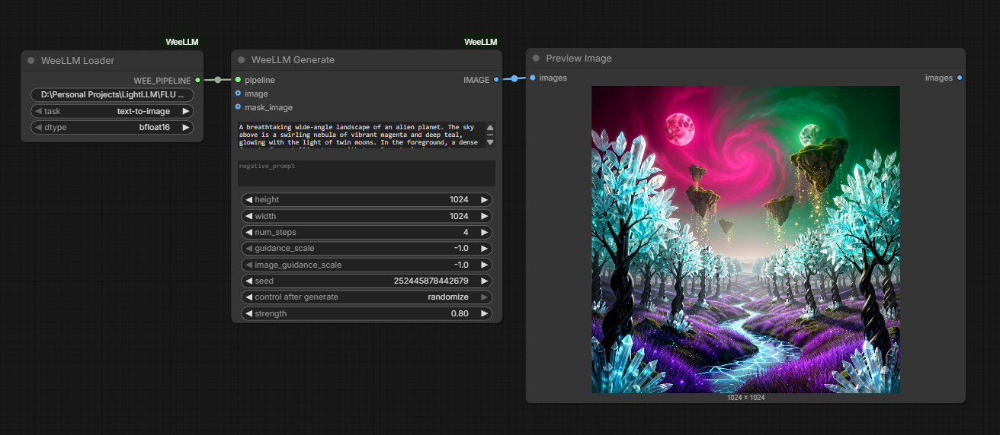

# ComfyUI-WeeLLM

A native ComfyUI custom node wrapper for [WeeLLM](https://github.com/Jit-Roy/weellm) — bringing ultra-low VRAM layer-streaming inference directly into your Comfy workflows.

With ComfyUI-WeeLLM, you can run massive diffusion models (like FLUX.1, SD3, and MiniMax-H3) on GPUs with **less than 4GB of VRAM**, without resorting to quantization or model degradation.




## Installation

### Method 1: ComfyUI Manager (Recommended)
1. Open the ComfyUI Manager.
2. Click **Install Custom Nodes**.
3. Search for `ComfyUI-WeeLLM` and click Install.
4. Restart ComfyUI.

### Method 2: Manual Git Clone
Navigate to your `ComfyUI/custom_nodes/` directory and run:
```bash
git clone https://github.com/Jit-Roy/ComfyUI-WeeLLM.git
cd ComfyUI-WeeLLM
pip install -r requirements.txt
```

## Nodes

### 1. WeeLLM Loader
Responsible for configuring and caching the model pipeline. 
- **`model_path`**: Provide the Hugging Face repo ID (e.g. `black-forest-labs/FLUX.1-schnell`) or a local directory.
- **`task`**: Select the type of pipeline to initialize (`text-to-image`, `image-to-image`, `video`).
- **`dtype`**: The precision to use (e.g., `bfloat16`).

### 2. WeeLLM Generate
Generates images using the loaded pipeline.
- Connect the `WEE_PIPELINE` from the Loader to this node.
- Supports optional **`image`** and **`mask_image`** inputs for automatic Image-to-Image and Inpainting.

### 3. WeeLLM Video Generate
Generates video batches for models like MiniMax-H3 FL2VA.
- Connect the `WEE_PIPELINE` from the Loader (with `video` task selected) to this node.
- Outputs an `IMAGE` batch that can be sent directly to Video Combine nodes.
